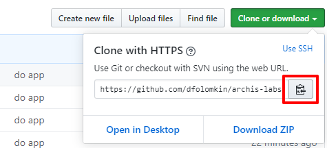
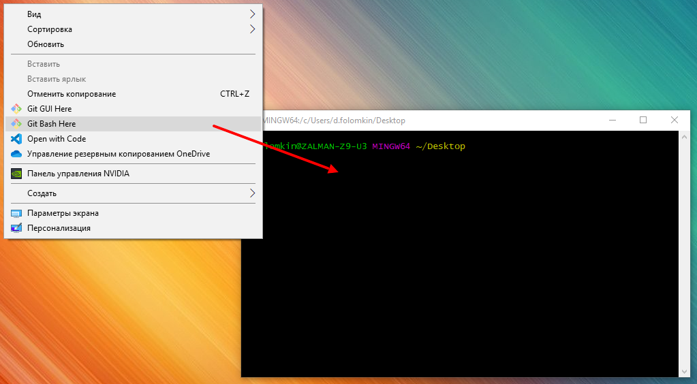

# Лабораторные работы по курсу "Архитектура информационных систем"

## Цель курса

Изучить реализацию архитектуры ИС с использованием веб-технологий.

Компоненты ИС:

- СУБД - нереляционная **MongoDB**

- Сервер (backend) - приложение на **Node.js** **Express**

- Клиент (frontend) - приложение на **JavaScript** в браузере

- Технология взаимодействия компонентов - **REST**

## Потребуется ПО

- [Git](https://git-scm.com/)

- [MongoDB](https://www.mongodb.com/download-center/community)

- [Robo 3T](https://robomongo.org/download)

- [Node.js](https://nodejs.org/en/) (включает npm)

- [MongoDB native driver](https://www.npmjs.com/package/mongodb) (через npm)

- [Mongoose ODM](https://www.npmjs.com/package/mongoose) (через npm)

- [Express](https://www.npmjs.com/package/express) (через npm)

- [Postman](https://www.getpostman.com/products)

- редактор кода [VS Code](https://code.visualstudio.com/download) / Sublime / Notepad++

- браузер Chrome / Firefox

## ЛР-1 Разработка БД на MongoDB. Исследование CRUD-операций с данными

MongoDB

TODO Robo 3T

## ЛР-2 Разработка скриптов на Node.js для CRUD-операции с данными MongoDB

Основные моменты JavaScript

Node.js, npm

MongoDB native driver

TODO Mongoose ODM

TODO Дебаг Node.js

## ЛР-3 Исследование HTTP-запросов и REST. Разработка серверной части (backend) на Node.js Express

Обработка HTTP-запросов, REST

Postman

Express, Middlewares

## ЛР-4 Разработка клиентской части (frontend) на JavaScript, HTML, CSS

HTML, CSS

Подключение скриптов, модули

DOM, Браузерные события

Fetch API

TODO Дебаг JavaScript

## ЛР-5 (доп) WebSocket

TODO?

## Как работать с этим репозиторием

Если вы это читаете, то вероятнее всего вы начали отсюда https://github.com/dfolomkin/archis-labs.

Этот репозиторий - основной источник информации, необходимой для выполнения лабораторных работ.

Он состоит из методичек, примеров и исходных файлов разделенных по лабораторным работам (всего их 4).

Вы можете читать методички онлайн, т.е. прямо с сайта GitHub.

Однако для запуска примеров и исходных файлов вам в первую очередь потребуется склонировать этот репозиторий себе на диск.

Для этого:

1. Скачайте [git](https://git-scm.com/) и установите его в системе.

2. На странице репозитория https://github.com/dfolomkin/archis-labs нажмите на кнопку "Clone or download" и скопируйте в буфер обмена адрес репозитория из появившегося всплывающего окна:



3. Выберите место в системе, где хотите расположить локальный репозиторий. По контекстному меню вызовите git-bash оболочку ("Git Bash Here").



4. В открывшемся окне git-bash введите (имя репозитория можно вставить из буфера обмена комбинацией Shift-Insert):

```
git clone https://github.com/dfolomkin/archis-labs
```

## Состав репозитория

Лаботаторные работы разделены по папкам (lab-1, ... lab-4).

В каждой папке обязательно есть методичка **manual.md** с основной информацией, необходимой для выполнения работы.

Остальное содержимое меняется в зависимости от работы.

В тех работах, где предполагается запуск скриптов, есть файл **package.json**, который содержит необходимую для запуска информацию, в т.ч. и зависимости.

Перед запуском скриптов:

1. Скачайте [Node.js](https://nodejs.org/en/download/) и установите его в системе.

Дистрибутив Node.js содержит также и менеджер пакетов **npm** (устанавливается автоматически вместе с Node.js), который и позволяет скачивать зависимости.

2. Скачайте(или обновите, если это не первый запуск в системе) зависимости. Для чего запустите консоль из папки с **package.json** и в ней введите:

```
npm i
```

## Как получать обновления

После того, как вы склонируете репозиторий, ваш локальный репозиторий будет связан с удаленным.

Поскольку данный курс постоянно развивается (я надеюсь), материал в удаленном репозитории со временем может измениться.

Связь репозиториев (локальный-удаленный) позволяет быстро (хоть и не автоматически) получать последние обновления (новые примеры, исправления ошибок и т.д.).

Для этого:

1. Перейдите в корень локального репозитория.

2. Откройте консоль и введите:

```
git stash
git pull
```

Для успешного обновления по вышеописанному сценарию предполагается, что вы не изменяете файлы в локальном репозитории (кроме, возможно, **package.json** и **package-lock.json**, которые могут измениться при обновлении зависимостей).

При изменении файлов в локальном репозитории, репозитории рассинхронизируются, и процесс обновления несколько усложняется.

Для тех, кто не очень хорошо знаком с системой контроля версии git, категорически рекомендуется работать в специально выделенной папке **./work** в каждой лабораторной работе (где предполагается писать скрипты). Иначе вы просто потеряете свои файлы (на самом деле их можно восстановить). Текущие настройки git игнорируют папку **./work**, что бы в ней ни произошло. Вы можете скопировать нужные исходники в эту папку и продолжить экспериментировать в ней.

Кстати, именно команда `git stash` "прячет" ваши изменения в локальном репозитории и позволяет успешно "спулиться" из удаленного.

Проверить, изменился ли удаленный репозиторий и стоит ли обновляться, можно с помощью команды:

```
git fetch
```

Как часто происходят обновления?

На самом деле я не могу гарантировать какую-то периодичность. Просто "спуливайтесь" каждый раз перед работой над лабораторкой.

## Какой редактор кода использовать

Вы можете использовать тот, который вам больше всего нравится.

Я рекомендую (особенно новичкам) [VS Code](https://code.visualstudio.com/download):

- Он бесплатный.
- У него простой, неперегруженный интерфейс.
- Все необходимые инструменты (для данного курса) есть "из коробки":
  - непосредственно сам редактор с авто-завершением и авто-форматированием,
  - менеджер файлов проекта,
  - дебаггер,
  - консоль,
  - git-клиент.
