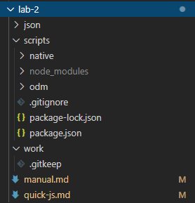

# ЛР-2 Разработка скриптов на Node.js для CRUD-операции с данными MongoDB

### Ключевые слова

Node.js, npm, пакеты, npm-модули, структура проекта, MongoDB native driver, npm: mongodb

### Цель работы

Познакомиться с серверным JS на платформе **Node.js**, его пакетным менеджером **npm**, структурой проекта на JS.

Научиться подключать и использовать драйвер MongoDB.

Научиться разрабатывать и запускать скрипты для выполнения CRUD-операций с данными MongoDB.

### Потребуется ПО

- редактор кода [VS Code](https://code.visualstudio.com/download) / Sublime / Notepad++

- [Node.js](https://nodejs.org/en/) (включает npm)

- [MongoDB native driver](https://www.npmjs.com/package/mongodb) (через npm)

- [Mongoose ODM](https://www.npmjs.com/package/mongoose) (через npm)

TODO добавить работу с Mongoose ODM

Также потребуется ПО из lab-1:

- [MongoDB](https://www.mongodb.com/download-center/community)

- командная оболочка системы (cmd, PowerShell, git bash, консоль VS Code)

### Быстрый переход

- [Теоретическая часть](##-Теоретическая-часть)

- [1 JS](###-1-JS)

- [2 Node.js, npm и структура проекта](###-2-Node.js,-npm-и-структура-проекта)

- [3 MongoDB native driver](###-3-MongoDB-native-driver)

- [Практическая часть](##-Практическая-часть)

- [Подготовка](###-Подготовка)

- [Выполнение](###-Выполнение)

- [Содержание отчета](###-Содержание-отчета)

- [Вопросы для самоконтроля](###-Вопросы-для-самоконтроля)

- [Информационные ресурсы](##-Информационные-ресурсы)

## Теоретическая часть

### 1 JS

Освежить знания JavaScript поможет этот документ [Основные моменты JavaScript](./quick-js.md).

Но лучше загляните на ([learn.javascript.ru](https://learn.javascript.ru/)).

### 2 Node.js, npm и структура проекта

Node или **Node.js** — программная платформа, основанная на движке V8 (транслирующем JavaScript в машинный код), превращающая JavaScript из узкоспециализированного языка в язык общего назначения. Node.js добавляет возможность JavaScript взаимодействовать с устройствами ввода-вывода через свой API (написанный на C++), подключать другие внешние библиотеки, написанные на разных языках, обеспечивая вызовы к ним из JavaScript-кода. Node.js применяется преимущественно на сервере, выполняя роль веб-сервера, но есть возможность разрабатывать на Node.js и десктопные оконные приложения (при помощи NW.js, AppJS или Electron для Linux, Windows и macOS) и даже программировать микроконтроллеры (например, tessel и espruino). В основе Node.js лежит событийно-ориентированное и асинхронное (или реактивное) программирование с неблокирующим вводом/выводом ([wiki](https://ru.wikipedia.org/wiki/Node.js)).

Node.js позволяет запускать .js-файлы из консоли:

```
cd ./lab-2/scripts/native
node connect
```

**npm** - менеджер пакетов, входящий в состав Node.js. Предоставляет доступ к огромному хранилищу различных пакетов (скриптов, библиотек и даже целых фреймворков), готовых для использования в вашем приложении, а также средства управления этими пакетами.

Пакеты представляют из себя обычные модули JS, готовые для импорта в ваши .js-файлы. Поэтому их называют по-разному: пакеты или npm-модули.

Npm (или его аналоги, например, yarn) используется практически в любом современном проекте. При этом **структура проекта** выглядит примерно так:



- node_modules/ - папка c используемыми в проекте пакетами

- package.json - файл с описанием проекта. Имеет примерно такое содержание:

```
{
  "name": "mongo-scripts",
  "version": "1.0.0",
  "description": "",
  "main": "index.js",
  "scripts": {
    "native:connect": "node ./native/connect",
    "native:insert": "node ./native/insert",
    "native:find-all": "node ./native/find-all",
    "native:find-by-query": "node ./native/find-by-query",
    "native:update": "node ./native/update",
    "native:remove": "node ./native/remove",
    "odm:connect": "node ./odm/connect"
  },
  "author": "",
  "license": "ISC",
  "dependencies": {
    "mongodb": "^3.2.3",
    "mongoose": "^5.5.0"
  }
}
```

т.е. в нем содержится какая-то мета-информация о проекте: название, версия, автор, лицензия, но что наиболее важно - список **зависимостей** (секция dependencies).
Список зависимостей содержит названия и версии всех пакетов, которые используются в проекте. А сами эти пакеты при установке (на самом деле это просто выкачивание из npm-хранилища) помещаются в папку node_modules/.

Например, в данной работе используются пакеты 'mongodb' и 'mongoose'.

Обычно проект имеет множество зависимостей, т.е. требует для своей работы множество пакетов, те в свою очередь требуют своих пакетов определенных версий и т.д. Все это приводит к тому, что папка node_modules весит очень много по мерками .js-файлов. Если бы ее приходилось передавать между участниками в процессе разработки проекта, это значительно осложнило бы ситуацию.


Файл package.json позволяет установить необходимые пакеты из npm-хранилища согласно секции dependencies и продолжить локальную разработку.

Чтобы это сделать, необходимо в консоли перейти в папку с package.json и ввести команду:

`npm i`

Обычно package.json располагается в корневой папке проекта (в данной работе это ./lab-2/scripts), там же появляется и node_modules/.

Пакеты можно устанавливать, удалять и обновлять отдельно:

`npm i mongodb@3.2.3` - установить пакет 'mongodb' конкретной версии 3.2.3

`npm i mongodb` - установить пакет 'mongodb'. Без указания версии установится самая последняя

`npm uninstall mongodb` - удалить пакет 'mongodb'

`npm update mongodb` - обновить пакет 'mongodb' до последней версии

При этом в файле package.json в секции dependecies происходят соответствующие изменения.

Причем, если пакет устанавливается без указания точной версии, то в package.json к его последней на момент установки версии будет добавлен значок '^': `"mongodb": "^3.2.3"`. Это означает, что при установки всех пакетов из package.json командой `npm i` установится mongodb версии 3.2.3 и выше, если более свежая версия будет существовать в момент установки. Поэтому иногда во избежании проблем совместимости при установки пакета фиксируют необходимую версию, удаляя символ '^'. Тогда запись в package.json выглядит так: `"mongodb": "3.2.3"`.

`npm i` также позволяет обновлять зависимости при их наличии и повторном запуске команды.

Чтобы использовать npm-модуль в .js-файле, сначала необходимо его импортировать c помощью `require`:

```
var driver = require('mongodb'); // импорт пакета с именем 'mongodb'
var MongoClient = driver.MongoClient;

var url = 'mongodb://localhost:27017';
var dbName = 'mydb';

var client = new MongoClient(url, { useNewUrlParser: true });
```

### 3 MongoDB native driver

Рассмотрим структуру скрипта для работы с MongoDB.

```
// подключаем пакет 'mongodb' и сразу же извлекаем из него необходимый класс MongoClient
var MongoClient = require('mongodb').MongoClient;

// устанавливаем параметры для подключения к необходимой БД
var url = 'mongodb://localhost:27017';
var dbName = 'mydb';

// получаем клиент (как инстанс класса MongoClient) для работы с БД
var client = new MongoClient(url, { useNewUrlParser: true });

// подключаем клиент к БД с помощью метода .connect()
client.connect(function(err) {
  if (err) {
    // сначала всегда обрабатываем ошибку; если есть ошибка, выводим ее в консоль
    console.log(err);
  } else {
    // если ошибки нет, и клиент успешно подключился, можно выполнять операции с БД
    console.log('Connected successfully to server');

    // выбираем необходимую БД с помощью метода клиента .db()
    var db = client.db(dbName);

    // выводим в консоль статистику БД с помощью метода .stats()
    // это асинхронный метод, поэтому обрабатываем промис с помощью .then()
    db.stats().then(function(stats) {
      console.log(stats);
    });

    // выбираем необходимую коллекцию с помощью метода клиента .collection()
    var collection = db.collection('clients');

    // выводим в консоль количество документов в коллекции с помощью метода .count()
    collection.count().then(function(count) {
      console.log('Clients count: ', count);
    });
  }

  // закрываем соединение после всех операций
  client.close();
});
```

Большинство методов точно такие же, как и при работе с MongoDB из консоли (т.к. в mongo shell также используется native driver).

## Практическая часть

### Подготовка

1. Запустите сервер MongoDB и оставьте его работающим:

`./bin/mongod --dbpath c:/mongodb/data --port 27017`

На всякий случай сделайте резервное копирование своей БД:

`./bin/mongodump --db [dbname] --out c:/mongodb/backup`

Для восстановления БД используйте:

`./bin/mongorestore --db [dbname] --drop c:/mongodb/backup/[dbname]`

Обращайте внимание на пути к файлам!

2. Установите Node.js (последнюю LTS-версию) [Node.js](https://nodejs.org/en/)

Проверьте правильность установки, введя в консоли следующие команды (должны показаться текущие версии):

```
node -v
npm -v
```

3. Подготовьте локальную копию репозитория к работе:

Склонируйте этот репозиторий в папку, отличную от местоположения сервера MongoDB.

Cкопируйте ./lab-2/scripts в ./lab-2/work и работайте там. Это позволит вам без проблем получать обновления данного руководства и примеров с помощью `git pull`.
Если не используете git а просто качаете .zip-файлы с github, можете не копировать папки и продолжать работать в ./lab-2/scripts.

Откройте консоль в ./lab-2/scripts(./lab-2/work/scripts) и введите команду `npm i`. Если устанавливаете пакеты первый раз, в консоли должно появится примерно такое сообщение:

```
npm WARN mongo-scripts@1.0.0 No description
npm WARN mongo-scripts@1.0.0 No repository field.

added 23 packages from 14 contributors and audited 35 packages in 1.425s
found 0 vulnerabilities
```

### Выполнение

Посмотрите примеры скриптов ./lab-2/scripts/native(./lab-2/work/native), измените их в соответствии с вашей БД и проверьте их работоспособность, запустив их в консоли с помощью `node ./connect` (например, для скрипта ./connect.js)

Обращайте внимание на номера портов, имена БД, коллекций и т.д.!

```
var url = 'mongodb://localhost:27017';
var dbName = 'mydb';
```

Реализуйте следующие пункты из lab-1 с помощью скриптов и проверьте их работоспособность:

4. Добавить несколько документов в каждую коллекцию (по 5-10) (используйте массив объектов).

5. Отработать различные варианты поиска (3-5 операций).

6. Обновить некоторые документы по различным критериям (3-5 операций).

7. Удалить некоторые документы по различным критериям (3-5 операций).

### Содержание отчета

Исходный код скриптов с описанием и результаты их выполнения.

### Вопросы для самоконтроля

## Информационные ресурсы

### Официальная документация

- [npm](https://docs.npmjs.com/files/package.json)

- [MondoDB](https://docs.mongodb.com/manual/mongo/)

- [MongoDB native driver](https://mongodb.github.io/node-mongodb-native/3.5/quick-start/quick-start/)

- [Mongoose ODM](https://mongoosejs.com/docs/index.html)

### Руководства и статьи

- Npm - пакетный менеджер Node.js ([youtube](https://www.youtube.com/watch?v=G4HmqOR0b8Q))

- Основы JS за 90 минут ([youtube](https://www.youtube.com/watch?v=4QHFhIjF2L0))

- Подключение базы данных к express ([youtube](https://www.youtube.com/watch?v=BmPUqg8A4PM))

### Полезные сервисы
