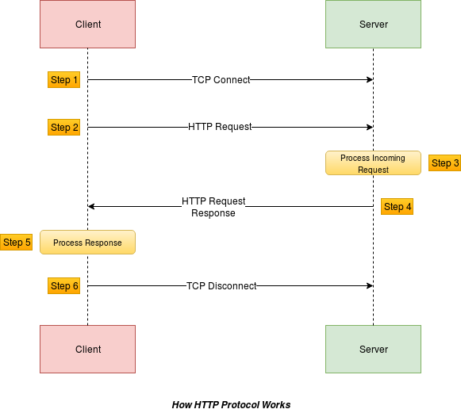
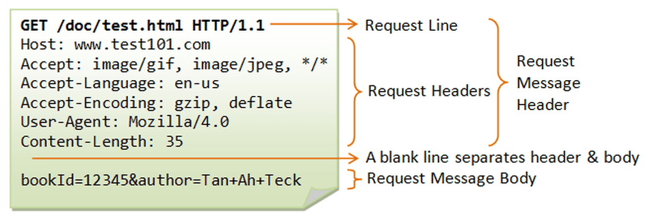
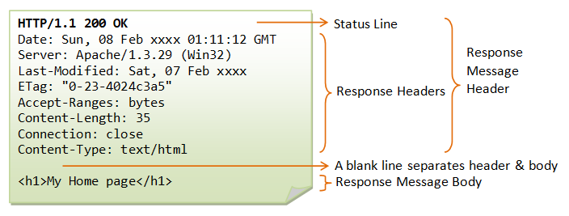
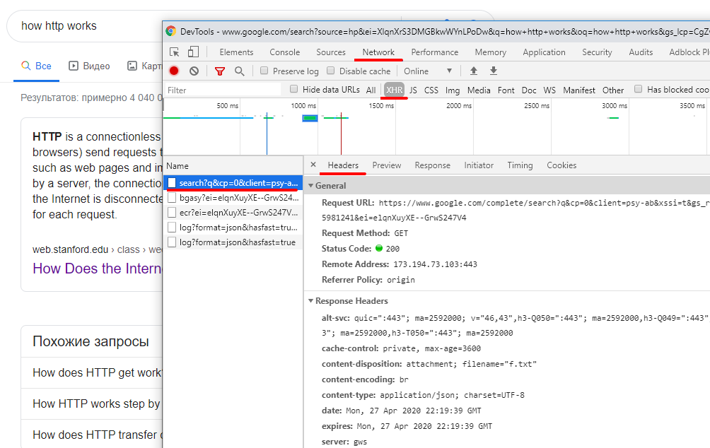
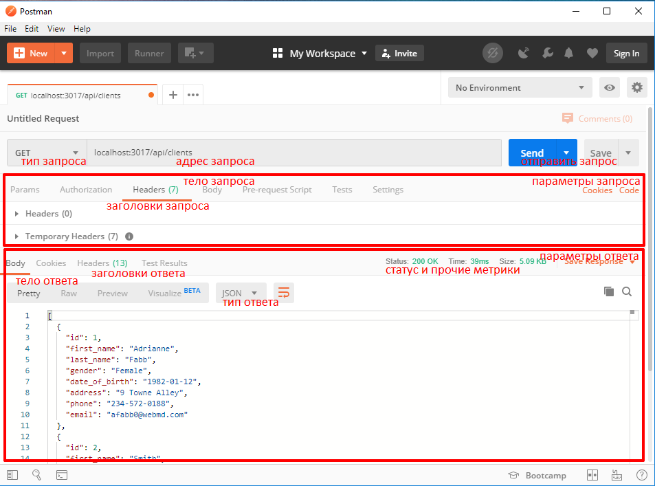
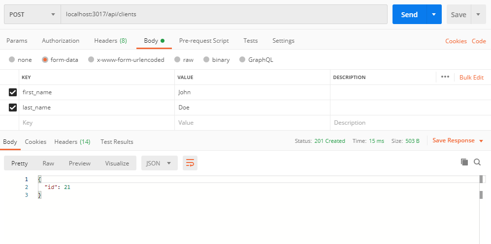
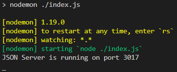

# ЛР-3 Исследование HTTP-запросов и REST. Разработка серверной части (backend) на Node.js Express

### Ключевые слова

HTTP-протокол, HTTP-запросы, REST, REST API, Node.js, Express, Postman

### Цель работы

Познакомиться с HTTP-протоколом и технологией взаимодействия компонентов **REST**. Изучить работу **HTTP-запросов**.

Изучить принцип тестирования REST API с помощью **Postman**.

Изучить принципы работы сервера на примере **Express** на **Node.js**.

Научиться разрабатывать простой сервер на **Express**.

### Потребуется ПО

- редактор кода [VS Code](https://code.visualstudio.com/download) / Sublime / Notepad++

- [Node.js](https://nodejs.org/en/) (включает npm)

- [MongoDB Native Driver](https://www.npmjs.com/package/mongodb) (через npm)

- [Json-server](https://www.npmjs.com/package/json-server) (через npm)

- [Express](https://www.npmjs.com/package/express) (через npm)

- [Postman](https://www.getpostman.com/products)

Также потребуется ПО из lab-1:

- [MongoDB](https://www.mongodb.com/download-center/community)

- командная оболочка системы (cmd, PowerShell, git bash, консоль VS Code)

### Быстрый переход

- [Теоретическая часть](##-Теоретическая-часть)

- [1 HTTP-протокол](###-1-HTTP-протокол)

- [Cхема протокола](####-Cхема-протокола)

- [HTTP-сообщения запроса и ответа](####-HTTP-сообщения-запроса-и-ответа)

- [HTTP-методы](####-HTTP-методы)

- [Коды состояний](####-Коды-состояний)

- [2 REST](###-2-REST)

- [3 Postman](###-3-Postman)

- [4 Express](###-4-Express)

- [Практическая часть 1 - Исследование HTTP-запросов и REST](##-Практическая-часть-1---Исследование-HTTP-запросов-и-REST)

- [Подготовка](###-Подготовка)

- [Выполнение](###-Выполнение)

- [Содержание отчета](###-Содержание-отчета)

- [Практическая часть 2 - Разработка серверной части (backend) на Node.js Express](<##-Практическая-часть-2---Разработка-серверной-части-(backend)-на-Node.js-Express>)

- [Подготовка](###-Подготовка)

- [Выполнение](###-Выполнение)

- [Содержание отчета](###-Содержание-отчета)

- [Вопросы для самоконтроля](###-Вопросы-для-самоконтроля)

- [Информационные ресурсы](##-Информационные-ресурсы)

## Теоретическая часть

### 1 HTTP-протокол

HTTP (англ. HyperText Transfer Protocol - протокол передачи гипертекста) - протокол прикладного уровня передачи данных изначально в виде гипертекстовых документов в формате HTML, в настоящий момент используется для передачи произвольных данных. Основой HTTP является технология клиент-сервер, т.е. предполагается существование:

- клиентов, которые инициируют соединение и посылают запрос

- серверов, которые ожидают соединения для получения запроса, производят необходимые действия и возвращают обратно сообщение с результатом ([wiki](https://ru.wikipedia.org/wiki/HTTP))

#### Cхема протокола

HTTP работает по следующей схеме:



1. Клиент инициирует соединение.

2. Клиент отправляет запрос посредством HTTP-сообщения.

3. Сервер обрабатывает запрос.

4. Сервер отправляет ответ посредством HTTP-сообщения.

5. Клиент обрабатывает ответ.

6. Клиент закрывает или переиспользует соединение (начиная с HTTP/1.1) для дальнейших запросов.

Актуальные версии HTTP - 1.1 (наиболее распространена) и 2.0.

#### HTTP-сообщения запроса и ответа

HTTP-сообщения **запроса** имеют следующую структуру:



- Строка запроса, которая содержит:

1. HTTP-метод (см. ниже), определяющий операцию, которую клиент хочет выполнить - GET

2. Путь к ресурсу - /doc/test.html


3. Версию HTTP-протокола - HTTP/1.1

- Заголовки, которые предоставляют дополнительную информацию для сервера

- Тело для некоторых методов (POST), которое содержит отправляемые данные

HTTP-сообщения **ответа** имеют следующую структуру:



- Строка статуса, которая содержит:

1. Версию HTTP-протокола - HTTP/1.1

2. Код состояния - 200

3. Сообщение состояния - 'OK'

- Заголовки, которые предоставляют дополнительную информацию для клиента

- Тело, которое содержит отправляемые данные

#### Пример - запрос страницы в браузере

Самый простой способ увидеть структуру HTTP-сообщений - открыть любую страницу в браузере Chrome и зайти в инструменты разработчика (F12 -> Network -> Headers):



Когда вы переходите на какую-либо страницу в браузере (клиент), фактически осуществляется GET-запрос на сервер (на котором расположен данный сервис), а в ответ приходят данные в формате .html, которые браузер использует для отображения элементов страницы.

#### HTTP-методы

Название HTTP-метода - ключевое слово, указывающее на основную операцию над ресурсом.

Существует несколько методов:

1. **GET** - используется в основном для запроса данных с сервера.

Например, `GET /path/resource?param1=value1&param2=value2 HTTP/1.1` - запрос ресурса '/path/resource'.

Часть после символа '?' - query string ("строка запроса"). С ее помощью можно передать дополнительную информацию, а также инициировать какой-либо процесс или вообще изменить семантическое назначение GET (запрашивать) и передавать данные (но ограниченный размер).

Query string видно в url браузера.

Query string может быть в заголовке любого запроса - это не уникальная особенность GET.

2. **POST** - используется для отправки данных на сервер, например, данные форм.

В отличие от GET имеет тело запроса, в котором и содержаться передаваемые данные. При этом обычный пользователь не видит данные в url как при использовании query string в GET-методе. Данные могут быть гораздо больших объемов чем в query string.

Например,

3. **PUT** - используется для изменения существующих данных

4. **DELETE** - используется для удаления существующих данных

5. HEAD - используется для проверки существования ресурса

Метод аналогичен GET, но ответ сервера не содержит тело, только заголовки.

6. PATCH

7. TRACE

8. CONNECT

GET и POST - наиболее часто используемые HTTP-методы.

POST, GET, PUT и DELETE - представляют CRUD-операции с данными:

| HTTP   | CRUD   |
| ------ | ------ |
| POST   | Create |
| GET    | Read   |
| PUT    | Update |
| DELETE | Delete |

#### Коды состояний

Код состояния информирует клиента об успешности выполнения его запроса.

Код состояния выражается трехзначным числом, где количество сотен указывает на тип кода.

Кодов состояний довольно много ([wiki](https://ru.wikipedia.org/wiki/%D0%A1%D0%BF%D0%B8%D1%81%D0%BE%D0%BA_%D0%BA%D0%BE%D0%B4%D0%BE%D0%B2_%D1%81%D0%BE%D1%81%D1%82%D0%BE%D1%8F%D0%BD%D0%B8%D1%8F_HTTP)). Вот некоторые примеры:

1. **1xx: Informational** (информационные):

- 101 Switching Protocols ("переключение протоколов")

- 102 Processing ("идёт обработка")

2. **2xx: Success** ("успешно"):

- 200 OK ("все в порядке")

- 201 Created ("создано")

- 202 Accepted ("принято")

3. **3xx: Redirection** (перенаправление):

- 302 Moved Temporarily ("перемещено временно")

- 307 Temporary Redirect ("временное перенаправление")

4. **4xx: Client Error** (ошибка клиента):

- 400 Bad Request ("неверный запрос")

- 401 Unauthorized ("не авторизован ")

- 403 Forbidden ("запрещено")

- 404 Not Found ("не найдено")

- 405 Method Not Allowed ("метод не поддерживается")

- 418 I'm a teapot ("я - чайник")

5. **5xx: Server Error** (ошибка сервера):

- 500 Internal Server Error ("внутренняя ошибка сервера")

- 501 Not Implemented ("не реализовано")

- 502 Bad Gateway ("плохой, ошибочный шлюз")

- 503 Service Unavailable ("сервис недоступен")

- 504 Gateway Timeout ("шлюз не отвечает")

- 520 Unknown Error ("неизвестная ошибка")

### 2 REST

REST (от англ. Representational State Transfer - "передача состояния представления") - архитектурный стиль взаимодействия компонентов распределённого приложения в сети. REST представляет собой согласованный набор ограничений, учитываемых при проектировании распределённой гипермедиа-системы. В определённых случаях (интернет-магазины, поисковые системы, прочие системы, основанные на данных) это приводит к повышению производительности и упрощению архитектуры. В широком смысле компоненты в REST взаимодействуют наподобие взаимодействия клиентов и серверов ([wiki](https://ru.wikipedia.org/wiki/REST)).

REST использует HTTP-запросы (в т.ч. с параметрами через url), но придает им больше семантичности (каждый метод отвечает строго за определнную операцию).

REST-методы состоят из названия HTTP-метода и ресурса (используется относительный путь), а также описания тела и прочих параметров соответствующих HTTP-методов:

- GET /api/clients - "получить всех клиентов"

- GET /api/clients/1 - "получить клиента с id: 1"

- POST /api/clients - "добавить нового клиента"

- PUT /api/clients/1 - "изменить клиента с id: 1"

- DELETE /api/clients/1 - "удалить клиента с id: 1"

Для веб-служб, построенных с учётом REST (то есть не нарушающих накладываемых им ограничений), применяют термин "RESTful".

Совокупность всех задокументированных REST-методов (название, путь и описание параметров соответствующих HTTP-запросов) представляет **RESTful API сервера** - программный интерфейс, который позволяет клиенту взаимодействовать с сервером.

Не существует "официального" стандарта для RESTful API, т.к. REST является архитектурным стилем, а не протоколом (как например SOAP). Несмотря на то, что REST не является стандартом сам по себе, большинство RESTful-реализаций используют такие стандарты, как HTTP, URL, JSON и XML.

### 3 Postman

Postman - приложение, которое представляется клиентом и позволяет отправлять запросы на сервер и просматривать ответы сервера. Приложение имеет удобный GUI ("графический интерфейс") для настройки параметров запросов и просмотра ответов сервера. Другими словами, Postman используется для проверки RESTful API сервера.

Основные элементы приложения показаны на рисунке:



Имеется возможность выбирать тип запроса, путь запроса, менять заголовки и т.д.

Например, отправка запрос GET /api/clients будет выглядеть как на рисунке выше.

Для POST /api/clients необходимо заполнить тело запроса и выбрать формат "form-data":



### 4 Express

Express - Node.js-фреймворк для написания сервера. Устанавливается как пакет 'express' (`npm i express`).

Структура кода express-сервера выглядит примерно так:

(см. ./express/index.js)

Для упрощения не используем модульное построение проекта.

Основными элементами express-сервера являются middlewares ("функцией промежуточной обработки"):

```
app.use(function (req, res, next) {
  console.log('Time:', Date.now());
  next();
});
```

```
app.get('/api/client/:id', function (req, res, next) {
  res.send('HI');
});
```

middleware используется в качестве параметра метода сервера app. Такие методы соответствуют REST-запросам: app.get(), app.post(), app.put(), app.delete() или app.use() - универсальный метод, сработает при любом REST-запросе на этот путь независимо от метода.

Смысл middleware - в извлечении необходимых свойства из объекта запроса req, формирование структуры ответа и вызове необходимых методов в объекте ответа res (req, res - это обычные js-объекты).

Опциональный аргумент next - это callback, который используется для следующего обработчика этого же пути (если он есть).

Важными свойствами req являются:

- req.params - объект параметров. Например, если придет запрос 'GET /api/clients/1' в middleware 'app.get('/api/client/:id', function() { ... })', то req.params === { id: 1 }

- req.headers - объект заголовков

- req.body - объект тела

Важными методами res являются:

- res.set() - метод для установки заголовков. Например, `res.set('Content-Type', 'text/plain')`

- res.status() - метод для установки кода состояния. Например, `res.status(200)`

- res.send() - метод для отправки тела в произвольном формате. Например, `res.send('Hi, client!')`

- res.json() - метод для отправки тела в формате JSON. Например, `res.send({ ... })`

Полный список свойств и методов можно посмотреть в официальной документации к express ([req](https://expressjs.com/ru/api.html#req), [res](https://expressjs.com/ru/api.html#res)).

Внутри middleware до момента отправки ответа методами res.send() или res.json() можно выполнять любые манипуляции с запросом и ответом, например, можно обратиться к БД:

```
app.get('/api/clients', function (req, res) {
  var client = new MongoClient(url, { useNewUrlParser: true });

  client.connect(function (err) {
    if (err) {
      console.log(err);
      res.status(500);
    } else {
      console.log('Connected successfully to server');

      var db = client.db(dbName);
      var collection = db.collection('clients');

      collection.find({}).toArray(function (err, docs) {
        // сортируем результаты
        var sortedDocs = (docs || []).sort(idComparator);

        res.json(sortedDocs);
      });

      client.close();
    }
  });
});
```

## Практическая часть 1 - Исследование HTTP-запросов и REST

В данной части предполагается работа с готовым сервером - json-server. Преимущество json-server'а перед реальной связкой "сервер приложений - сервер БД" в том, что он использует .json-файл в качестве БД. Нет необходимости подключаться к MongoDB. Это удобно при разработке и тестировании клиента или, например, при изучении работы REST API. Именно научиться работать с REST API сервера и программой Postman - задача данной части.

### Подготовка

1. Считаем, что Node.js уже установлен в системе (в лаб. 2).

2. Установите [Postman](https://www.getpostman.com/products).

3. Подготовьте локальную копию репозитория к работе:

Cкопируйте ./lab-3/json-server в ./lab-3/work и работайте там.

Откройте консоль в ./lab-3/json-server(./lab-3/work/json-server) и введите команду `npm i`.

4. Введите в консоли `npm start` - запустится сервер на порту 3017:



Оставьте сервер работающим на время выполнения лабораторной.

По умолчанию в качестве БД сервер использует файл db.json, в котором всего одна "коллекция" - clients. Вы можете заменить данные вашими.

После выполнения лабораторной отключите json-server (ctrl + C в консоли)!

### Выполнение

Используя Postman, последовательно выполните серию запросов к json-server'у. Зафиксируйте параметры запроса и результаты. Проанализируйте тело и заголовки ответа.

1. Выполните GET-запрос

- тип: GET
- путь: localhost:3017/api/clients
- формат ответа: JSON

2. Выполните POST-запрос

- тип: POST
- путь: localhost:3017/api/clients
- тело: {
  "first_name": "New First Name",
  "last_name": "New Last Name"
  }
- формат тела: form-data
- формат ответа: JSON

3. GET localhost:3017/api/clients/1

4. PUT localhost:3017/api/clients/2

5. DELETE localhost:3017/api/clients/3

### Содержание отчета

Скрины из Postman и описание параметров запроса и ответа (метод, путь, заголовки, тело, статус ответа и т.д.) - для каждого запроса.

## Практическая часть 2 - Разработка серверной части (backend) на Node.js Express

### Подготовка

1. Запустите сервер MongoDB и оставьте его работающим:

`./bin/mongod --dbpath c:/mongodb/data --port 27017`

На всякий случай сделайте резервное копирование своей БД:

`./bin/mongodump --db [dbname] --out c:/mongodb/backup`

Для восстановления БД используйте:

`./bin/mongorestore --db [dbname] --drop c:/mongodb/backup/[dbname]`

2. Подготовьте локальную копию репозитория к работе:

Cкопируйте ./lab-3/express в ./lab-3/work и работайте там.

Откройте консоль в ./lab-3/express(./lab-3/work/express) и введите команду `npm i`.

### Выполнение

3. Доработайте код сервера ./lab-3/express/index.js(./lab-3/work/express/index.js) в соответствии с вашей БД.

Необходимо написать REST API минимум для 3ех коллекций!

4. Введите в консоли `npm start` - запустится сервер на порту 3017.

Оставьте сервер работающим на время выполнения лабораторной.

Важно! Порт используется тот же, что и для json-server'a. Поэтому не забудьте отключить json-server (ctrl + C в консоли) перед выполнением части 2.

5. Используя Postman протестируйте REST API вашего сервера и зафиксируйте результаты.

### Содержание отчета

Скрины из Postman и описание параметров запроса и ответа (метод, путь, заголовки, тело, статус ответа и т.д.) - для каждого запроса.

### Вопросы для самоконтроля

## Информационные ресурсы

### HTTP, REST

- HTTP ([wiki](https://ru.wikipedia.org/wiki/HTTP))

- Обзор протокола HTTP ([developer.mozilla.org](https://developer.mozilla.org/ru/docs/Web/HTTP/Overview))

- Что такое протокол HTTP и как он работает ([link](https://www.iguides.ru/main/other/chto_takoe_protokol_http_i_kak_on_rabotaet/))

- Простым языком об HTTP ([habr](https://habr.com/ru/post/215117/))

- HTTP-коды состояний ([wiki](https://ru.wikipedia.org/wiki/%D0%A1%D0%BF%D0%B8%D1%81%D0%BE%D0%BA_%D0%BA%D0%BE%D0%B4%D0%BE%D0%B2_%D1%81%D0%BE%D1%81%D1%82%D0%BE%D1%8F%D0%BD%D0%B8%D1%8F_HTTP))

- REST ([wiki](https://ru.wikipedia.org/wiki/REST))

- REST простым языком ([medium](https://medium.com/@andr.ivas12/rest-%D0%BF%D1%80%D0%BE%D1%81%D1%82%D1%8B%D0%BC-%D1%8F%D0%B7%D1%8B%D0%BA%D0%BE%D0%BC-90a0bca0bc78))

### Express

- Официальный ресурс ([expressjs.com](https://expressjs.com/))

- Как использовать middleware ([expressjs.com](https://expressjs.com/ru/guide/using-middleware.html))

- Пишем API на NodeJS от loftblog ([youtube](https://www.youtube.com/watch?v=fHoKs66Z2qQ&list=PLY4rE9dstrJzrDaSPKOrhNgQ19GhVl19u))

- Инструмент Postman ([youtube](https://www.youtube.com/watch?v=ZpxjS8ZB0MA))

### Полезные сервисы

- Все коды ошибок HTTP ([link](http://allerrorcodes.ru/http-2/))
