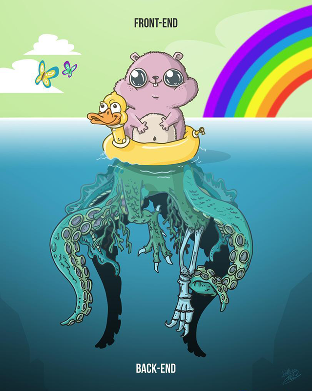

# ЛР-4 Разработка клиентской части (frontend) на JavaScript, HTML, CSS

### Ключевые слова

Браузер, UI, Frontend, HTML, DOM, JavaScript, JS, CSS, Bootstrap, Fetch API

### Цель работы

Познакомиться с некоторыми технологиями, применяемыми при разработке Frontend-приложения (клиентское приложение в браузере).

Научиться разрабатывать простой UI (пользовательский интерфейс) для работы с данными.

### Потребуется ПО

- редактор кода [VS Code](https://code.visualstudio.com/download) / Sublime / Notepad++

- браузер Chrome / Firefox

Также потребуется ПО из предыдущих работ:

- [Node.js](https://nodejs.org/en/) (включает npm)

- [MongoDB Native Driver](https://www.npmjs.com/package/mongodb) (через npm)

- [Express](https://www.npmjs.com/package/express) (через npm)

- [MongoDB](https://www.mongodb.com/download-center/community)

- командная оболочка системы (cmd, PowerShell, git bash, консоль VS Code)

### Быстрый переход

- [Теоретическая часть](##-Теоретическая-часть)

- [1 HTML](###-1-HTML)

- [Блочные / строчные элементы](####-Блочные-/-строчные-элементы)

- [2 CSS](###-2-CSS)

- [3 JS в браузере](###-3-JS-в-браузере)

- [DOM](####-DOM)

- [Обработка событий](####-Обработка-событий)

- [Получение данных](####-Получение-данных)

- [Практическая часть](##-Практическая-часть)

- [Подготовка](###-Подготовка)

- [Выполнение](###-Выполнение)

- [\* Дополнительные задания](###-*-Дополнительные-задания)

- [Важные моменты в примере](###-Важные-моменты-в-примере)

- [Содержание отчета](###-Содержание-отчета)

- [Вопросы для самоконтроля](###-Вопросы-для-самоконтроля)

- [Информационные ресурсы](##-Информационные-ресурсы)

## Теоретическая часть

Frontend-приложение (FE-приложение) - клиентское приложение, работающее в браузере.

Если рассматривать FE-приложение в контексте информационной системы с трехзвенной клиент-серверной архитектурой, то FE-приложение используется в основном в качестве GUI (графического интерфейса пользователя) для работы с серверными данными и дополнительно имеет некоторую логику для преобразования этих данных.



Frontend подразумевает использование следующих технологий:

- HTML (HyperText Markup Language) - язык разметки гипертекста. Отвечает за разметку элементов интерфейса, т.е. размер, расположение их относительно друг друга и страницы и т.д. Самая старая технология из рассматриваемых. Используя только HTML можно создавать сайты со статичной информацией.

- CSS (Cascade Style Sheets) - каскадные таблицы стилей. Используется для стилизации интерфейса. Вместе с HTML отвечает за то, что видит пользователь.

- JS (JavaScript) - язык программирования, изначально разрабатываемый для работы в браузере. Позволяет реализовать логику приложения (обработку событий, отправку данных и т.д.) и добавить динамичности сайту.

### 1 HTML

HTML (англ. HyperText Markup Language - "язык гипертекстовой разметки") - стандартизированный язык разметки документов во Всемирной паутине. Большинство веб-страниц содержат описание разметки на языке HTML (или XHTML). Язык HTML интерпретируется браузерами; полученный в результате интерпретации форматированный текст отображается на экране монитора компьютера или мобильного устройства [wiki](https://ru.wikipedia.org/wiki/HTML).

На всякий случай: это не язык **программирования**!

Текущая версия - HTML5 (`<!DOCTYPE html>`).

Расширение файла - .html (+ варианты .htm, .xhtml).

Структура html-документа состоит из:

- `<head>` - заголовка, в котором содержится мета-информация о странице;

- `<body>` - тела, в котором содержится сама разметка, которую видно в браузере.

Выглядит это примерно так:

```
<!DOCTYPE html>
<html lang="en">
  <head>
    <title>My awesome app</title>
    <meta charset="utf-8" />
    <meta name="viewport" content="width=device-width, initial-scale=1" />
  </head>

  <body>
    ...
  </body>
</html>
```

Разметка осуществляется с помощью различных элементов, которые в .html-документе обозначаются **тэгами**: `<head>`, `<body>`, `<div>`, `<table>`, `<a>`, ``, ...

Элементы, которые могут содержать в себе другие элементы, обозначаются парными тэгами (открывающим и закрывающим), например, `<div></div>`.

Элементы имеют не только соответствующие названия тэгов, но и некоторый набор аттрибутов и их значений:

- как общих для всех тэгов, например, `<div id="main" class="content"></div>`,

- так и специфических для конкретного или для ограниченной группы тэгов, например, ``.

Подробнее о всех тэгах и их аттрибутах можно почитать на специальных ресурсах, например [http://htmlbook.ru/html](http://htmlbook.ru/html).

Некоторые тэги, которые используются в работе:

`<div> content </div>` - основной блок для отображения контента

`<h1>Header 1</h1>` - `<h6>Header 6</h6>` - заголовки уровней 1-6

`<a href="https://google.com">google</a>` - ссылка на ресурс (на другую страницу сайта, документ или любой другой ресурс)

Таблица:

```
<table>
  <thead>
    <th>Header 1</th>
    <th>Header 2</th>
  </thead>
  <tbody>
    <tr>
      <td>row 1 - column 1</td>
      <td>row 1 - column 2</td>
    </tr>
    <tr>
      <td>row 2 - column 1</td>
      <td>row 2 - column 2</td>
    </tr>
  </tbody>
</table>
```

Форма - составной элемент, который объединяет в себе несколько других:

```
<form name="client" method="POST" action="https://.../api">
  <div>
    <label for="first-name">First name</label>
    <input id="first-name" name="first-name" type="text" value="John" />
  </div>
  <div>
    <label for="second-name">Second name</label>
    <input id="second-name" name="second-name" type="text" value="Doe" />
  </div>
  <button type="submit">Send data</button>
</form>
```

`<label for="first-name">First name</label>` - метка поля

`<input id="first-name" name="first-name" type="text" value="John" />` - поле ввода с начальным значением value="John". Можно обращаться по имени name="first-name".

Форма часто используется для редактирования и отправки данных на сервер. Для этого в HTML предусмотрен свой механизм без использования JS (один из немногих механизмов на чистом HTML).

`<button type="submit">Send data</button>` - кнопка отправки данных формы.

Если указать type="submit", то при нажатии на такую кнопку данные формы будут отправляться на ресурс action="https://.../api" с помощью метода method="POST" (указывается в качестве аттрибутов тэга `<form>`)

Подробнее о различных элементах формы и их аттрибутов можно почитать на [https://html5book.ru/html5-forms/](https://html5book.ru/html5-forms/).

#### Блочные / строчные элементы

Все многообразие HTML-элементов по поведению на странице можно разделить на 3 типа:

- Строчные (display: inline по-умолчанию)

- Блочные (display: block по-умолчанию)

- Строчно-блочные (display: inline-block по-умолчанию)

Строчные: `<a>`, `<span>`, `<b>`, `<i>`, `<strong>` и другие элементы для работы с текстом.

Строчные элементы располагаются в строку один за одним, а если не умещаются в строке, то переносятся на следующую, как обычные слова в тексте.
У строчных элементов нельзя задать высоту (height) и вертикальные отступы (margin-top, margin-bottom), но можно задать внутренние отступы (padding). Ширина строчного элемента (width) автоматически определяется по его содержимому.
Не допускается, чтобы строчные элементы содержали в себе блочные, такая верстка будет не валидной.

Блочные: `<div>`, `<p>`, `<H1>` - `<H6>`, `<table>`, т.е. элементы, задающие структуру документа.

Блочные элементы автоматически располагаются друг под другом каждый с новой строки и по-умолчанию занимают 100% ширины родителя.
В отличие от строчных у блочных элементов можно задать любые размеры: высоту (height), ширину (width), любые внешние отступы (margin) и конечно внутренние отступы (padding).
Блочные элементы могут содержать в себе другие элементы любого типа, поэтому всегда имеют парные тэги `<div></div>`.

Строчно-блочные: ``, `<input>`, `<button>`, `<select>`, `<textarea>`, т.е. в основном это элементы форм.

Такие элементы ведут себя на странице, как строчные, т.е. располагаются друг за другом и переносятся при заполнении строки. Однако у них можно задать любые размеры, как у блочных.

Свойство display можно поменять, придав тем самым нужное поведение элементу. Так например, можно задать display: inline-block у элемента `<div>`. Такой прием иногда используется для верстки.

### 2 CSS

Аттрибуты тэгов (например, width, height, background, color) позволяют лишь частично стилизовать элементы. Гораздо более широкими возможностями обладает технология CSS.

CSS-свойства позволяют описывать форму, размеры, цвет фона, прозрачность элемента, тип и размер шрифта, параметры границ элемента, тени, расположение элементов относительно документа и друг друга, создавать анимацию.

CSS (англ. Cascading Style Sheets - "каскадные таблицы стилей") - формальный язык описания внешнего вида документа, написанного с использованием языка разметки. Преимущественно используется как средство описания, оформления внешнего вида веб-страниц, написанных с помощью языков разметки HTML и XHTML, но может также применяться к любым XML-документам, например, к SVG [wiki](https://ru.wikipedia.org/wiki/CSS).

Текущая версия - CSS3.

Расширение файла - .сss.

Использовать CSS можно несколькими способами.

1. Внутренние (inline) стили - в аттрибуте style каждого тэга, где это необходимо:

`<a href="" style="color: red; font-weight: bold"></a>`

2. Глобальные стили - в тэге `<style></style>` в заголовке документа:

```
<head>
  <title>My awesome app</title>
  <meta charset="utf-8" />
  <meta name="viewport" content="width=device-width, initial-scale=1" />

  <style type="text/css">
    a { color: red; font-weight: bold }
  </style>
</head>
```

3. Внешние стили - в отдельном файле .css с подключением в заголовке документа:

```
<head>
  <title>My awesome app</title>
  <meta charset="utf-8" />
  <meta name="viewport" content="width=device-width, initial-scale=1" />

  <link href="./styles.css" rel="stylesheet" />
</head>
```

При этом содержимое .css выглядит примерно так:

```
  a {
    color: red;
    font-weight: bold;
  }

```

Последний способ предпочтительнее, потому что позволяет поддерживать определенную структуру проекта и делает .html-файлы чище (разделение ответственности). Будет использоваться в работе.

Если используются глобальные или внешние стили, то для соответствия определенному HTML-элементу используется "селектор".

Различают несколько типов селекторов:

- по id

* по классу

- по тэгу

- универсальный

[подробнее](https://learn.javascript.ru/css-selectors)

По отношению элементов друг к другу селекторы могут быть:

- вложенные

- дочерние

- соседние

[подробнее](https://learn.javascript.ru/css-selectors)

Подробнее о всех селекторах и css-свойствах можно почитать на [http://htmlbook.ru/css](http://htmlbook.ru/css).

Существуют специальные CSS-фреймворки и библиотеки, которые содержат набор стилей и упрощают разработку интерфейсов (в основном там, где нет необходимости в уникальном дизайне).

Например, [Bootstrap](https://getbootstrap.com/) или [jQuery UI](https://jqueryui.com/).

### 3 JS в браузере

JavaScript - мультипарадигменный язык программирования. Поддерживает объектно-ориентированный, императивный и функциональный стили. Является реализацией стандарта ECMAScript.

Наиболее широкое применение находит в браузерах как язык сценариев для придания интерактивности веб-страницам [wiki](https://ru.wikipedia.org/wiki/JavaScript).

Текущие версии - ES5, ES6 (наиболее часто используемые).

Расширение файла - .js.

JS работает в браузере по-умолчанию, без установки дополнительного ПО. Это осуществляется за счет встроенного в браузер JS-движка (JS Engine). Например, наиболее известный движок - V8 в браузере Chrome.

Кстати, V8 является JS-движком и в Node.js.

JS-код можно писать прямо в .html внутри тэга `<script>`:

```
<body>
  ...
  <script type="text/javascript">
    var name = 'John Doe';
  </script>
</body>
```

Но принято все-таки использовать отдельный .js-файл, для подключения которого в .html-файле используется такая конструкция:

```
<body>
  ...
  <script src="./script.js"></script>
</body>
```

Подключение .js в самом конце `<body>` - самый простой способ гарантированно дождаться загрузки контента страницы. Есть и другие способы.

Последний способ позволяет поддерживать определенную структуру проекта и поддерживает разделение ответственности файлов. Будет использоваться в работе.

#### DOM

JS не "видит" страницу как пользователь, и даже не "видит" ее как структуру HTML-тэгов. Чтобы в JS была возможность манипулировать структурой страницы, реагировать на действия пользователя и существует DOM.

DOM (Document Object Model) - объектная модель документа, которая представляет все содержимое страницы в виде объекта.

При этом иерархическая структура HTML-тэгов соответствует DOM-дерево, в котором каждый узел-элемент соответствует тэгу (кроме узлов-элементов есть еще и текстовые узлы).

Объект `document` - основная "входная точка", самый верхнеуровневый элемент. С его помощью возможно что-то создавать или менять на странице.

```
document.body.style.background = "red";
```

Для доступа к самому элементу используется конструкция `document.documentElement`.

Для поиска элементов используются следующие методы элемента:

`.getElementById('main')` - возвращает найденный элемент по id

`.getElementsByClassName('section')` - возвращает коллекцию найденных элементов по class

`.querySelectorAll('.section')` - возвращает коллекцию найденных элементов по css-селектору (наиболее универсальный метод поиска)

Все методы манипуляции с элементами вызываются у верхнеуровневого элемента, например, у `document`:

```
document.querySelectorAll('.section');
```

**Коллекция** - не имеет методов массивов (поскольку фактически это не массив, хоть и выглядит похоже), но имеет длину `collection.length` и возможность обращаться к элементам по индексу `collection[0]`.

- может быть перебрана в цикле `for() { ... }`, но только для чтения.

- может быть преобразована в массив с помощью `Array.from()` c последующим применением методов массива (`.map()`, `.filter()` и др.):

```
var collection = document.querySelectorAll('.section');
var arr = Array.from(collection);
arr.map(function(item) {
  console.log(item)
});
```

Для навигации по DOM-дереву используются следующие свойства элемента:

`.parentElement` - возвращает родительский элемент

`.previousElementSibling` / `.nextElementSibling` - возвращает предыдущий / следующий элемент равного уровня

`.children` - возвращает дочерние элементы (коллекция всех)

`.firstElementChild` / `.lastElementChild` - возвращает первый / последний дочерний элемент

Для вставки / удаления используются следующие свойства элемента:

`.createElement()` - создать элемент

```
var el = document.createElement('<div class="section"></div>');
```

`.append()` / `.prepend()` - добавить элемент в конец / в начало элемента, у которого данные методы вызываются

```
var childEl = document.createElement('<div class="section"></div>');
var parentEl = document.querySelectorAll('.main');
parentEl.append(childEl);
```

`.remove()` - удалить элемент

Кроме того в JS имеется возможность манипуляции с аттрибутами элементов.

[подробнее](https://learn.javascript.ru/document)

Современный JS обладает достаточным набором инструментов для манипуляции с DOM. В более ранних стандартах функционал был не слишком богатым, и приходилось использовать специальные библиотеки. Наиболее популярная из них - [jQuery](https://jquery.com/), используется и по сей день для обеспечения совместимости кода с разными версиями браузеров, а также для удобства разработки.

#### Обработка событий

Когда пользователь взаимодействует со страницей (например, вводит данные в поле ввода, кликает мышкой на кнопку, прокручивает страницу и т.д.), генерируются браузерные события.

Прикрепить обработчик события можно разными способами:

1. С помощью аттрибута события прямо в .html:

```
<input type="button" onclick="acceptName()" value="Accept Name">
```

2. С помощью свойства DOM-объекта:

```
inputEl.onclick = function(e) {
  acceptName(e);
};
```

3. С помощью метода .addEventListener():

```
inputEl.addEventListener('click', function(e) {
  acceptName(e);
});
```

Рекомендуется использовать последний способ, он в отличие от предыдущих позволяет отписываться от событий (в некоторых случая это позволяет избежать утечки памяти).

```
var handler = function(e) {
  acceptName(e);
};
inputEl.addEventListener('click', handler);
inputEl.removeEventListener('click', handler);
```

Именно это способ будет использоваться в работе.

[подробнее](https://learn.javascript.ru/events)

#### Получение данных

Для получения данных с сервера используется функция fetch():

```
var request = fetch(url, {
  method: "GET", // POST, PUT, DELETE, etc.
  headers: {
    "Content-Type": "text/plain;charset=UTF-8"
  },
  body: undefined // string, FormData, Blob, BufferSource или URLSearchParams
});
```

fetch() возвращает промис, поэтому результат запроса нужно обрабатывать с помощью .then():

```
request
  .then(function(data) {
    data.json();
  })
  .then(fucntion(jsonData) {
    doSmthWith(jsonData);
  });
```

[подробнее](https://learn.javascript.ru/fetch-api)

## Практическая часть

### Подготовка

1. Запустите сервер MongoDB и оставьте его работающим:

`./bin/mongod --dbpath c:/mongodb/data --port 27017`

На всякий случай сделайте резервное копирование своей БД:

`./bin/mongodump --db [dbname] --out c:/mongodb/backup`

Для восстановления БД используйте:

`./bin/mongorestore --db [dbname] --drop c:/mongodb/backup/[dbname]`

2. Запустите express-сервер (порт 3017) и оставьте его работающим:

`cd lab-3/express`

`npm i`

`npm start`

3. Подготовьте локальную копию репозитория к работе:

Cкопируйте './lab-4/app' в './lab-4/work' и работайте там.

Откройте консоль в './lab-4/app' (или './lab-4/work/app') и введите команду `npm i`.

### Выполнение

1. Доработайте код приложения './lab-4/app/src/app.js' (или './lab-4/work/app/src/app.js') в соответствии с вашей предметной областью.

UI должен состоять из:

- таблицы с данными

- кнопки заполнения формы изменения выбранной записи и соответствующей логики

- кнопки удаления выбранной записи и соответствующей логики

- формы добавления новой записи и соответствующей логики

- формы изменения выбранной записи и соответствующей логики

Желательно разработать подобный функционал больше, чем для одной коллекции MongoDB, расположить его на разных страницах и организовать переключение между страницами с помощью меню из гиперссылок.

Для разработки интерфейса для новой коллекции:

- добавьте в проект новую папку с содержимым подобно './lab-4/app/src/clients'.

- подключите этот новый модуль (например, products) в './lab-4/app/src/app.js:

```
import * as products from './products/products.js';
```

Важно! Проверьте соответствие путей ваших запросов и api сервера!

Например,

```
function refreshClientsGrid() {
  fetch(apiUrl + '/clients')
    .then(...);
}
```

в ./lab-4/app/app.js соответствует

```
app.get('/api/clients', function (req, res) { ... });
```

в ./lab-3/express/index.js

Можно использовать [bootstrap](https://getbootstrap.com/) для стилизации.

2. Введите в консоли `npm start` - запустится сервер разработки на порту 9017.

Оставьте сервер работающим на время выполнения лабораторной.

3. Откройте браузер по url 'http://localhost:9017/' и наблюдайте ваш прекрасный UI.

### \* Дополнительные задания

1. Сделайте меню для переключения между данными разных коллекций.

2. Формы добавления и редактирования записи разместите в открывающихся модальных окнах.

3. Сделайте таблицу, которая отображает данные из смежных таблиц. Например, при клике на определенном клиенте в этой таблице отображаются все его покупки (возможно понадобится доработать сервер из lab-3).

### Важные моменты в примере

Функция `refreshClientsGrid()` делает запрос данных с сервера с помощью метода .fetch() и вызывает `renderClientsGrid(data)` для отрисовки данных:

```
function refreshClientsGrid() {
  fetch(apiUrl + '/clients')
    .then(function (res) {
      return res.json();
    })
    .then(function (data) {
      console.log(data);
      renderClientsGrid(data);
      addClientRowHandlers();
    });
};
```

Используется первый раз при загрузке страница, а также каждый раз после принятия ответов сервера на другие запросы на изменение данных.

Функция `renderClientsGrid(data)` принимает данные и преобразует их в таблицу с помощью метода .map():

```
function renderClientsGrid(data) {
  var clientsGridEl = document.getElementById('clientsGrid');
  ...
  data.forEach(function (item, index) {
    var rowEl = document.createElement('tr');

    rowEl.innerHTML = ...;

    clientsGridEl.appendChild(rowEl);
  });
}
```

Следующий код добавляет обработчики на клики всех кнопок "Edit" в таблице. Сами обработчики вызывают функцию `populateEditClientForm(id)` для заполнения формы редактирования соответствующими данными из таблицы:

```
var editClientBtnEls = document.getElementsByClassName('js-editClientBtn');

for (var i = 0; i < editClientBtnEls.length; i++) {
  var item = editClientBtnEls[i];

  item.addEventListener('click', function (event) {
    var id = event.target.parentElement.parentElement.getElementsByClassName(
      'js-clientId'
    )[0].innerHTML;

    populateEditClientForm(id);
  });
}
```

Функция `populateEditClientForm(id)` делает GET-запрос данных по id и заполняет поля формы, когда эти данные придут в ответе:

```
function populateEditClientForm(id) {
  fetch(apiUrl + '/clients/' + id)
    .then(function (res) {
      return res.json();
    })
    .then(function (data) {
      document.forms.editClientForm.elements.id.value = data.id;
      ...
      document.forms.editClientForm.elements.email.value = data.email;
    });
}
```

Для обращения к форме как к объекту должны быть проставлены аттрибуты 'id' у формы и 'name' у ее полей в .html:

```
<form id="editClientForm">
  <div class="form-group row">
    <label class="col-sm-3 col-form-label">Id</label>
    <div class="col-sm-9">
      <input name="id" type="text" class="form-control" disabled />
    </div>
  </div>
  ...
  <div class="form-group row">
    <label class="col-sm-3 col-form-label">Email</label>
    <div class="col-sm-9">
      <input name="email" type="text" class="form-control" />
    </div>
  </div>
  ...
```

Следующий код добавляет обработчик на клик кнопки "Edit" на форме редактирования. Обработчик собирает данные полей формы 'editClientForm' в специальный объект 'FormData' и делает PUT-запрос на сервер. Когда приходит успешный ответ, таблица с данными перерисовывается заново (`refreshClientsGrid()`), а поля формы очищаются:

```
editClientFormEl.addEventListener('submit', function (event) {
  event.preventDefault();

  var formData = new FormData(document.forms.editClientForm);

  fetch(
    apiUrl + '/clients/' + document.forms.editClientForm.elements.id.value,
    {
      method: 'PUT',
      headers: {},
      body: formData,
    }
  )
    .then(function (res) {
      return res.json();
    })
    .then(function (data) {
      refreshClientsGrid();
      document.forms.editClientForm.reset();
    });
});
```

Похожий функционал реализован и для формы добавления, с той лишь разницей, что запрос - POST и форма не заполняется данными из таблицы.

### Содержание отчета

TODO

### Вопросы для самоконтроля

## Информационные ресурсы

### HTML

- Справочник HTML ([htmlbook.ru](http://htmlbook.ru/html))

- Строчные vs. Блочные элементы ([html5book.ru](https://html5book.ru/block-inline-elements/))

- HTML форма ([html5book.ru](https://html5book.ru/html5-forms/))

### CSS

- Справочник CSS ([htmlbook.ru](http://htmlbook.ru/css))

- Способы подключения стилей ([link](https://www.hostinger.ru/rukovodstva/podklyucheniye-css-stiley))

- Селекторы ([learn.javascript.ru](https://learn.javascript.ru/css-selectors))

- [Bootstrap](https://getbootstrap.com/)

- [jQUeryUI](https://jqueryui.com/)

### DOM, События

- Объект document ([learn.javascript.ru](https://learn.javascript.ru/document))

- Как обходить коллекцию html-элементов ([stackoverflow](https://stackoverflow.com/questions/22754315/for-loop-for-htmlcollection-elements))

- Браузерные события ([learn.javascript.ru](https://learn.javascript.ru/events))

- FormData ([learn.javascript.ru](https://learn.javascript.ru/formdata))

- Как обрабатывать данные формы c типом 'multipart/form-data' ([stackoverflow](https://stackoverflow.com/questions/35192841/fetch-post-with-multipart-form-data))

- Fetch API ([learn.javascript.ru](https://learn.javascript.ru/fetch-api))
